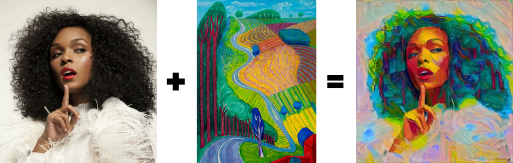
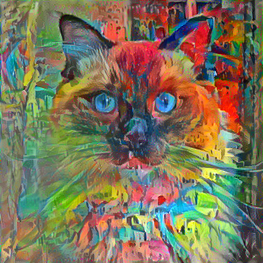
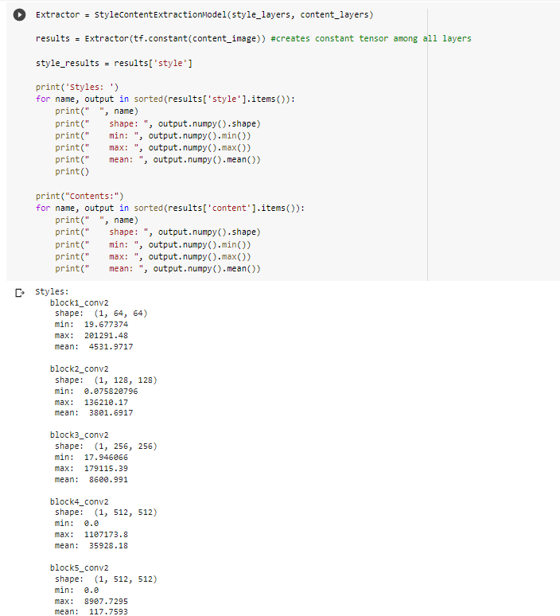

# Neural-Style-Transfer
Hello and welcome to this notebook. 

The following project was build in a python jupyter notebook. 
The project consists of buliding a neural style transfer model using a [VGG-19 model](https://keras.io/api/applications/vgg/) in tensorflow. 

The structure of the project is as follows:

1. Import Packages
2. Data Visualization
3. Using the VGG19 architecture
4. Building The Model
5. Content and Style Extraction 
6. Gradient Descent
7. Total Variation Loss Function
8. Final Optimization Step
9. Bonus Section

The paper that this project is based off of is [A Neural Algorithm of Artistic Style](https://arxiv.org/abs/1508.06576) by Gatys et al. (2015)

This project consists of using a convolutional neural network (CNN) and uses two different images to blend them together. Thus, creating an artistic style usinging one image as our content image and the other image to style the content image.

We would get something similar to the result you see below: 

I had a lot of fun reading about VGG19 model architectures and the paper this project is based off of.

Thanks for reading and have a great day. 

## Authors

- [@alexmason97](https://github.com/alexmason97)

  
## Example

In this notebook, we use a picture of a ragdoll cat as our content image:

And **Mendrisiotto with Church of Obino** by Hermann-Scherer:

after optimizing all of our weights, content and style layer and variation loss weights, we run our images through 10 epochs of 100 iterations each.

The final result is the following:

  
## License

[MIT](https://choosealicense.com/licenses/mit/)

MIT License

Copyright (c) [2021]

Permission is hereby granted, free of charge, to any person obtaining a copy
of this software and associated documentation files (the "Software"), to deal
in the Software without restriction, including without limitation the rights
to use, copy, modify, merge, publish, distribute, sublicense, and/or sell
copies of the Software, and to permit persons to whom the Software is
furnished to do so, subject to the following conditions:

The above copyright notice and this permission notice shall be included in all
copies or substantial portions of the Software.

THE SOFTWARE IS PROVIDED "AS IS", WITHOUT WARRANTY OF ANY KIND, EXPRESS OR
IMPLIED, INCLUDING BUT NOT LIMITED TO THE WARRANTIES OF MERCHANTABILITY,
FITNESS FOR A PARTICULAR PURPOSE AND NONINFRINGEMENT. IN NO EVENT SHALL THE
AUTHORS OR COPYRIGHT HOLDERS BE LIABLE FOR ANY CLAIM, DAMAGES OR OTHER
LIABILITY, WHETHER IN AN ACTION OF CONTRACT, TORT OR OTHERWISE, ARISING FROM,
OUT OF OR IN CONNECTION WITH THE SOFTWARE OR THE USE OR OTHER DEALINGS IN THE
SOFTWARE.
## Python Packages Used in Notebook

- os
- tensorflow as tf
- matplotlib.pyplot as plt 
- matplotlib as mpl
- numpy as np
- time 
- functools
- IPython.display
- PIL.Image

## Notebook Screenshots

